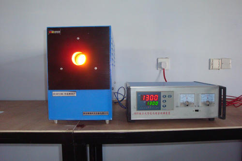
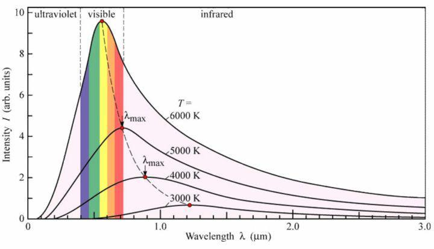
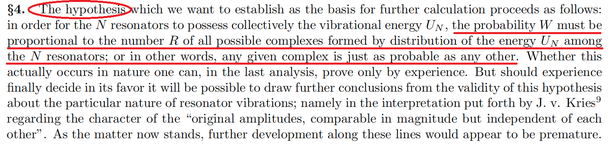
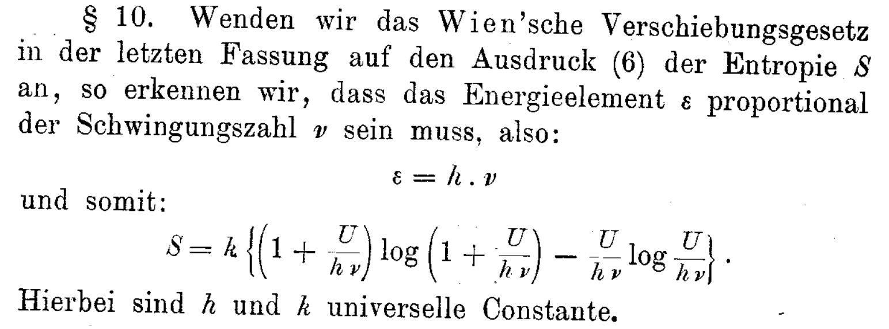
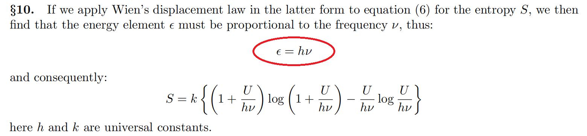
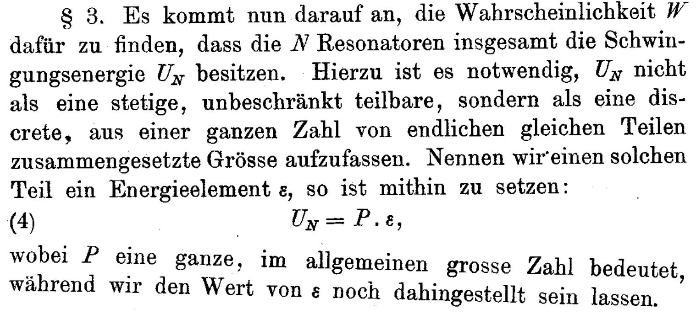
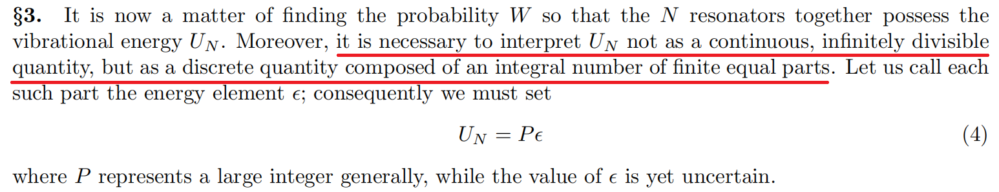

# 
普朗克常数h的诞生和量子化假设的由来

作者: ITMANLog (BezmLogShang@outlook.com)； 时间：2021年3月27日

#### 题记
最近，量子计算机的研究进展据说可能会带来新一轮的技术革命。计算机大家都很熟悉，但量子是什么，估计只有那些能默写薛定谔方程的专业人士才能明白。互联网上关于量子物理的科普讲解很多，看了之后感觉很神奇，但又有点玄幻。为了更科学准确了解量子，寻根溯源，从量子观念的产生和发展过程出发，窥探历史上的物理学大师做科学研究的思路，这对非物理专业的人士来说或许是个不错的办法。普朗克常数（$h=6.62607015 \times 10^{-34} \ J\cdot s$）是量子力学中非常重要的物理常数，最近认真仔细研读了普朗克当年引入$h$的那篇研究论文，弄懂了黑体辐射的一些物理知识，也发现了关于量子的一些有趣的内容。写个东西把所读所思梳理一下，以加深理解，也作为学习过程的知识积累。

## 1. 内容简介

1900年，普朗克在研究黑体辐射问题时，基于能量量子化的分析方法发现了$\epsilon=h\nu$这个神奇的公式（其中，$\epsilon$表示能量，$\nu$表示频率，$h$即普朗克常数，取值为$6.62607015 \times 10^{-34}$，量纲为$J\cdot s$“焦耳秒”），为后来量子物理大厦的构建提供了“量子化假设”和“普朗克常数”这两块重要基石。为了更加准确理解量子的科学内涵，本文通过研读普朗克1901年发表在德国物理学年鉴《Annalen Der Physik》上的研究论文[^1]（因为不懂德文，实际看的是英文翻译版的[^2]），基本弄懂了普朗克常数的来龙去脉，对量子化假设也有了更清晰的认识。此外，学习过程中，结合自己的思考，从中发现了一些新的有趣的内容。

## 2. 普朗克要解决的问题
针对当时黑体辐射实验的理论解释存在的问题（仅在一定范围内适用），设法建立一个更加完善的分析理论，使得各种条件下的理论分析结果都能与实验数据相符合。

## 3. 黑体辐射的一些准备知识
与黑体辐射相关的一个直观理解可以通过下图这个烧红的铁块来说明。

当温度较低时铁块发出暗红色的光，当温度较高时铁块发出亮黄色的光。在铁匠铺通常根据颜色来估计铁块是否够热。物理学中要研究的黑体辐射问题，可以理解为研究铁块温度和发光颜色（即波长和频率）等各种物理量之间的定量关系。

为了排除实验干扰因素，获得精准测量数据，物理学家设计了专门研究这个问题的实验仪器。这种实验仪器现在网上能查得到（如下图），估计大学物理专业很多学生都做过这个实验。

实验数据反映各个物理量之间的关系可以通过下面这个曲线图来说明。

其中，横坐标为辐射出的电磁波的波长，纵坐标为辐射强度，不同曲线反映不同温度下波长和辐射强度的变化关系，最下面一条曲线对应的温度为$T=3000K$（开尔文温标），最上面一条曲线对应的温度为$T=6000K$。

可以看到，温度越高，辐射越强，而且在不同温度下辐射最强的那个波长$\lambda_{max}$各不相同，这就是热铁块呈现不同颜色的原因。据说运用这种曲线关系，通过测量太阳光中不同颜色光的强度，就可算出太阳的温度。后来，据说还可以用来对宇宙温度进行测算，可见这其中蕴含了某个普遍适用的物理规律。

## 4. 普朗克的研究思路
1900年，普朗克研究黑体辐射问题的时候，物理学界已经积累了较多实验数据，也给出了一些理论解释。普朗克主要在维恩研究成果（Wien approximation[^3]）的基础上，通过适当改进某些假设及其相关物理量的计算方式，以建立更广泛适用的理论。根据普朗克的说明，维恩理论中存在的不合理假设，这在当时已经有人提出，而他的论文主要工作是尝试修正这些假设，以找到一个更符合实验结果的新的理论计算公式。

具体来说，普朗克主要改进了维恩关于黑体辐射整个系统的熵的分析假设和计算方式。论文中，普朗克简要说明了他改进熵的计算方式的主要过程：
1. 从熵的定义公式$d S=\frac{d U}{T}$出发，计算得出与维恩一样的结果；
2. 随着研究的深入，普朗克发现了熵的其他计算方式，所需假设条件为：在分析系统的一个无限小不可逆变化过程时，系统熵的增加只与系统总能量的变化有关，而与单个谐振子（系统由N个一样的谐振子构成）的能量无关；
3. 但普朗克对这个假设并不满意，因为它与经验认知不符，所以**普朗克提出了新的假设条件，从熵这个概念更深层的含义出发，综合运用玻尔兹曼熵公式$S=klogW$和熵定义公式$d S=\frac{d U}{T}$建立了一个新的更加简洁的熵计算方法，并推导得到了新的更加适用的辐射理论公式**。

上面加粗的这个句子概括了当时普朗克认为他这篇论文所完成的工作，普朗克在论文引言部分用了大段篇幅来进行说明。说白了就是，在维恩研究的基础上，改进理论分析假设，得到更好的理论计算公式。论文在计算熵的过程中，普朗克用单独一段（Section 4）讲述了他的这个重要假设：在使用公式$S=klogW$计算熵的时候，$W$正比于所有可能的微观状态的数量，即每一个微观状态可能出现的概率是一样，下面是对应的论文截图。

至于 **普朗克常数$h$** 和 **量子化假设** 等对量子物理影响深远的内容，在普朗克的这篇论文中都是在解决黑体辐射问题过程中附带引入的，要在论文中认真仔细去找才能发现他们。

## 5. 普朗克常数$h$的诞生
### 5.1. $h$第一次出现的样子
下面先给出普朗克常数$h$在论文中出现时的原文截图（德文为原版，英文为翻译版）。

**普朗克常数的诞生-德文版**

**普朗克常数的诞生-英文翻译版**

需要补充说明的是，普朗克在德文期刊《Annalen Der Physik》发表其论文之前，已在1900年的学术会议上发表过相关研究内容，准确地说，$h$的第一次出现应该在那个会议文集上。

当读到论文中这个公式$\epsilon=h\nu$时，本以为这就是普朗克写下“量子化假设”那个神来之笔的地方，但仔细读完整篇论文才发现这个公式是被推导出来的，$h$只是为了描述两个物理量$\epsilon$和$\nu$之间正比关系而引入的一个未知比例系数常量，感觉这个公式在论文中并不是一个重要公式，因为它连公式编号都没有。可见，普朗克当时并没有意识到$\epsilon=h\nu$这个公式的重要意义，它的价值在后来才慢慢被物理学家们发现。

### 5.2. $h$是怎么被引入的
普朗克在计算熵的时候，用两种不同计算方式得到了两个不同计算公式：
1. 用$S=klogW$计算，得到$S=k\{(1+\frac{U}{\epsilon})log(1+\frac{U}{\epsilon})-\frac{U}{\epsilon}log(\frac{U}{\epsilon})\}$，可简单记为函数关系$S=g(\frac{U}{\epsilon})$；
2. 用$d S=\frac{d U}{T}$计算，得到$S=f(\frac{U}{\nu})$，其中$f$为某个待定函数，即只知道$S$和$\frac{U}{\nu}$之间存在函数关系，但具体函数表达式是未知的。

因为两个公式$S=f(\frac{U}{\nu})$和$S=g(\frac{U}{\epsilon})$计算的是同一个黑体辐射系统的熵，对比两个公式的形式可知$\frac{U}{\nu}$和$\frac{U}{\epsilon}$之间存在正比关系，设比例系数为$h$，则$\frac{U}{\nu}=h\frac{U}{\epsilon}$，所以得到
 $$\epsilon=h\nu$$

这就是普朗克引入$h$的全过程，而且推理过程比较跳跃，很难一眼从中看出$h$的意义。总体上来说，普朗克引入$h$的过程有点像是在一个反向推理的过程，具体如下：
1. 要找到符合实验结果的黑体辐射理论公式，需要找到熵和能量之间的关系公式；
2. 要找到熵和能量之间的关系公式，可以用两种不同的方式从能量$U$出发计算出熵$S$；
3. 但两种方式得出的计算式$S=f(\frac{U}{\nu})$和$S=g(\frac{U}{\epsilon})$都有未知的函数或变量（函数$f$和变量$\epsilon$是未知的）；
4. 两个等式，两个未知项，所以可以反向推理得出变量$\frac{U}{\nu}$和$\frac{U}{\epsilon}$之间的正比关系，即$\epsilon=h\nu$；
5. 若正比关系的比例系数$h$的数值可以确定，则问题得到解决。

第4步是反向推理的关键点，即只要找到使得第3步成立的充分条件即可。找到的这个充分条件越简单，而且适用范围越广泛，则其反应的物理规律越深刻。

第5步是问题得到解决的基础，因而在论文的第三大部分（Numerical Values）中，普朗克的主要工作就是估算这个未知比例系数$h$的数值，并验证由此推出的新的黑体辐射公式的正确性。

## 6. 量子化假设的“神来之笔”
在普朗克的论文中，**因为要用玻尔兹曼熵公式计算整个系统的熵，所以需要将系统总能量细分为若干微小等份进行分析**，原文截图如下：

**量子化假设最初的表述-德文版**

**量子化假设最初的表述-英文翻译版**

在当时普朗克看来，为了计算熵，对总能量进行这样的离散化处理好像并没什么特别的，因而仅在论文中提了一句，没有说原因，也没有展开，更没有作为一个重要假设专门提出来。有可能在当时的热力学研究中，这样的处理手法是非常普遍的，有点像对连续函数求定积分时把变量范围细分为若干微小等份进行分析的方法。普朗克这个“神来之笔”在当时看来好像也并不那么神，至于这个宝藏如何被后续的物理学家发现，估计得去读读其他论文。

## 7. 一些有趣的发现
1. 论文在提到量子化假设和引入普朗克常数这两个重要地方都与玻尔兹曼熵公式有关：一个是为了能够使用玻尔兹曼熵公式做计算需要将能量看作（interpret as）某个微小等分能量$\epsilon$的整数倍；一个是为了使得玻尔兹曼公式算出的熵与基于定义公式算出的熵相等而推出能量$\epsilon$与辐射频率$\nu$之间的正比关系$\epsilon=h\nu$。再深入分析，会发现更多有趣的内容：
    1.1. 研究一下从玻尔兹曼熵公式$S=klogW$得到的黑体辐射系统的熵计算公式$S=k\{(1+\frac{U}{\epsilon})log(1+\frac{U}{\epsilon})-\frac{U}{\epsilon}log(\frac{U}{\epsilon})\}$，发现在这个公式中，$\epsilon$这个微小等分能量块显然不能无限小，否则系统熵$S$将无限大，也就是说，$S=klogW$熵公式的使用条件中暗含了量子化的假设；
    1.2. 为什么玻尔兹曼熵公式会暗含量子化假设呢？个人觉得，$S=klogW$应该是热力学研究气体熵的时候对气体分子状态进行统计分析得到的公式，而气体肯定是由整数个相同气体分子组成的，这本身就是物理事实（可称之为“气体量子化”），所以普朗克在使用公式$S=klogW$来计算黑体辐射的系统熵时，公式本身就已经把量子化这个物理事实带进来了；
    1.3. 早在1877年，玻尔兹曼就给出$S=klogW$这个公式，为什么一直没人发现其中暗含的量子化这个普遍的物理事实呢？个人觉得，热力学研究中，气体量子化是显然的事实（或许在玻尔兹曼的时候也没那么显然，据说当时马赫就曾质疑玻尔兹曼[^4]），而在黑体辐射研究中，系统总能量是量子化的，这给人的感觉总不是那么显然。
2. 现在介绍黑体辐射的很多资料都把瑞利-金斯公式、维恩公式和普朗克公式一起讲，而且常会给人一个错觉：普朗克突然获得天启，神奇般提出量子化假设和$\epsilon=h\nu$公式，并推导出普朗克辐射公式，一举征服了瑞利-金斯和维恩（普朗克公式在低频条件下退化为瑞利-金斯公式，在高频条件下退化为维恩公式）。仔细读完普朗克的论文原文，发现现在网上的一些讲法有以讹传讹的嫌疑：
    2.1. 普朗克的论文主要是在维恩研究基础上做的改进，从而得到了黑体辐射的普朗克公式，应该跟瑞利-金斯公式没什么关系，因为论文中根本就没提到过瑞利-金斯公式，不管是参考文献还是正文都没提到过；
    2.2. 网上也有一些说法认为普朗克先提出了能量量子化假设，才推导得到普朗克辐射公式。这样的讲法可能来自不同的参考资料。本文主要参考普朗克自己的论文，应该更为准确。此外Wikipedia可作为本文观点的一个佐证，其中词条Planck postulate[^5]说到：“he (Planck) considered quantization as being purely a mathematical trick”，即普朗克认为量子化只是当时用来处理问题的一个纯数学技巧。
3. 据说早在1877年，玻尔兹曼就曾提出能量量子化的观点[^6]，估计量子化这个深刻的物理事实应该在玻尔兹曼推导其公式$S=klogW$时，就有所领悟，只是由于思想太超前，当时人都不好接受，甚至到1900年的普朗克也仅是从数学工具的角度而不是从物理事实的角度来理解量子化。所以要搞清楚量子的深刻内涵，可能还得再往前追溯到1877年的玻尔兹曼。

#### 参考资料
[^1]: M. Planck. (1901). Ueber das Gesetz der Energieverteilung im Normalspectrum. Annalen Der Physik, 4, 553. Retrieved from http://www.physik.uni-augsburg.de/annalen/history/historic-papers/1901_309_553-563.pdf 这是德文原版，该版论文发表之前，普朗克已在1900年的学术会议上发表过相关研究内容

[^2]: M. Planck. (1901). On the Law of Distribution of Energy in the Normal Spectrum. Annals of Physics, 4, 553. Retrieved from http://people.isy.liu.se/jalar/kurser/QF/references/Planck1901.pdf 这是个英文翻译版，网上有各种不同的翻译版本，要与本文内容对应，请注意版本是否匹配

[^3]: Wikipedia, Wien's approximation (also sometimes called Wien's law or the Wien distribution law) at https://en.wikipedia.org/wiki/Wien_approximation

[^4]: Wikipedia, Ernst Mach, at https://en.wikipedia.org/wiki/Ernst_Mach. He famously declared, after an 1897 lecture by Ludwig Boltzmann at the Imperial Academy of Science in Vienna: "I don't believe that atoms exist!"

[^5]: Wikipedia, Planck postulate, at https://en.wikipedia.org/wiki/Planck_postulate

[^6]: Wikipedia, Ludwig Boltzmann, at https://en.wikipedia.org/wiki/Ludwig_Boltzmann. Boltzmann could also be considered one of the forerunners of quantum mechanics due to his suggestion in 1877 that the energy levels of a physical system could be discrete.
